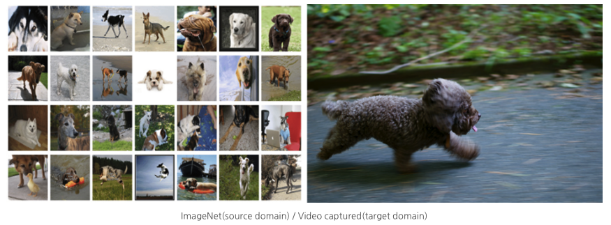
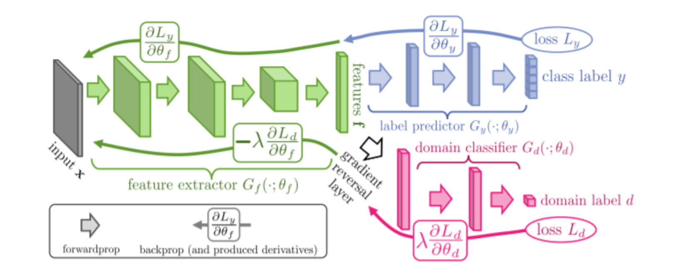

# Domain Adaptation
## domain adaptation based on adversarial learning

### 🧐Specific Task : Domain Adaptation

Domain Adaptation

## How would the performance when applied to images captured on YouTube with classifiers learned from ImageNet data?

The performance is poor. Because the images captured on ImageNet and YouTube are very fundamental different. For example, the difference is that the images in the video domain has low resolution, motion blur and pose variety.
As a result, the reason for the poor performance is that the source domain (labeled data) and target domain (unlabeled data) are different.

→ How can we learn to generalize? : “Learn a representation that cannot distinguish domains”

DANN(Domain Adversarial Neural Network) performs two tasks at the same time:
Classification of class labels and Domain of source and target.
- Minimize training classification error
- Maximize training and test domain classification error

In other words, learning in the direction of weakening the Domain Discriminator so that the
feature representation does not distinguish between source domain and target domain while
maintaining the role of the classifier well.

Minmax Game
- Minimize Training Classification Error
- Maximize Training & test domain classification error

참고해서 정리 필요
https://yjs-program.tistory.com/168
